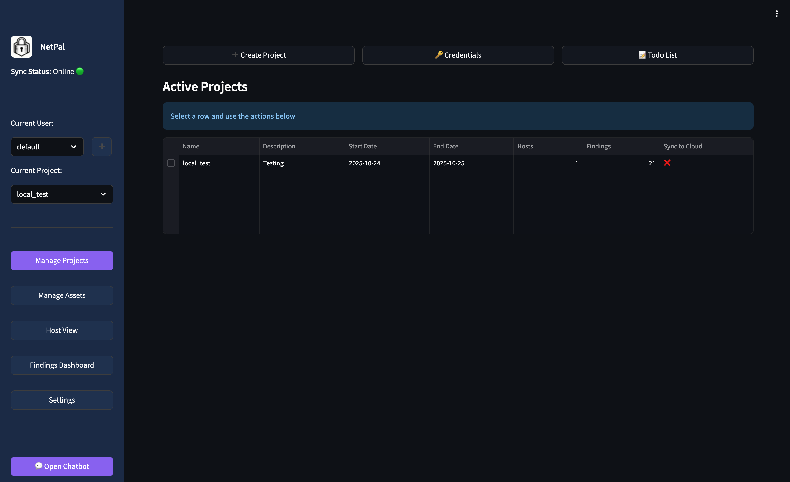

# NetPal - Network Penetration Testing Tool

NetPal is a network penetration testing tool built with Python and Streamlit. It provides a web interface for managing penetration testing projects, running network scans, running security tools against identified hosts, and tracking findings.



## Features

### 🎯 Core Capabilities
- **Project Management**: Create and manage multiple pentest projects with descriptions, timelines, credentials, and todo lists
- **Network Organization**: Organize targets by network ranges or IP/hostname lists
- **Host Discovery**: Automated and manual host management with service enumeration
- **Vulnerability Scanning**: Integrated with Nuclei for automated vulnerability detection
- **Finding Tracking**: Finding management with severity levels
- **Network Visualization**: Interactive network graphs showing relationships between networks, hosts, and services
- **☁️ Cloud Sync**: Optional automatic synchronization with AWS DynamoDB and S3
- **🔌 Offline Mode**: Full functionality without internet connection using local storage

### 🔧 Integrated Tools
- **nmap**: Port scanning and service version detection
- **nuclei**: Automated vulnerability scanning with extensive template library
- **httpx**: HTTP probing and automatic screenshot capture for web services
- **netexec**: SMB enumeration and authentication testing

### 🤖 Automation Features
- **Auto-Discovery**: Automated host and service discovery via nmap
- **Smart Tool Suggestions**: Context-aware tool recommendations based on open ports and services
- **Auto-Execution**: Configurable automatic execution of security tools
- **Screenshot Capture**: Automatic screenshots of web services (ports 80, 443, 8080, etc.)

### 📊 Reporting & Analytics
- **Findings Dashboard**: Centralized view of all security findings across projects
- **Statistics**: Visual analytics with severity distribution and trend analysis
- **CSV Export**: Export findings to CSV for reporting

## Installation

You have two installation options:

### Option 1: Virtual Environment (Recommended)

Creates an isolated Python environment for the project:

```bash
# Run setup (creates venv, installs dependencies, configures AWS)
bash setup.sh

# Sets python venv and runs app 
bash run.sh
```

Or manually:
```bash
source venv/bin/activate
streamlit run app.py
```

### Installing Security Tools (Optional)

NetPal works with these external tools for enhanced functionality:
- **nmap**: Port scanning
- **nuclei**: Vulnerability scanning
- **httpx**: HTTP probing and screenshots
- **netexec**: SMB enumeration

Install them using [`install.sh`](install.sh): (This is done automatically in setup.sh)
```bash
chmod +x install.sh
./install.sh
```

Or install manually:
```bash
# macOS
brew install nmap
go install github.com/projectdiscovery/nuclei/v3/cmd/nuclei@latest
go install github.com/projectdiscovery/httpx/cmd/httpx@latest
pipx install git+https://github.com/Pennyw0rth/NetExec

# Linux
sudo apt install nmap
go install github.com/projectdiscovery/nuclei/v3/cmd/nuclei@latest
go install github.com/projectdiscovery/httpx/cmd/httpx@latest
pip3 install git+https://github.com/Pennyw0rth/NetExec
```

## Cloud Sync & AWS Configuration

NetPal supports automatic cloud synchronization when online, enabling data sharing across multiple machines and backup to AWS.

### 🌐 Online vs Offline Mode

**Online Mode** (when authenticated with AWS):
- ✅ Automatic sync with DynamoDB and S3 every page interaction

**Offline Mode** (when not authenticated):
- ✅ Full functionality using local JSON storage
- ✅ All features work except cloud sync and AI chatbot
- ℹ️ Data stored locally in `data/` and `scan_results` directory

**AI Chatbot**:
- Accessible in Online or Offline mode, need to set AWS profile in config/ai_settings.ymal

### Cloud Resources

When online mode is enabled, NetPal uses these AWS resources:

| Resource | Type | Purpose |
|----------|------|---------|
| `netpal-projects` | DynamoDB Table | Stores project data (auto-created) |
| `netpal-states` | DynamoDB Table | Stores user states (auto-created) |
| `<need to add own name since S3 is unique>` | S3 Bucket | Stores scan results and screenshots |

Tables are automatically created on first run if they don't exist.

## Usage

### Starting the Application

Run the Streamlit application:
```bash
bash run.sh
```

The application will open in your default web browser at `http://localhost:8501`

### Workflow

#### 1. Create a Project
- Navigate to the **Projects** page
- Click **Create New Project** tab
- Fill in project details (name, description, dates)
- Click **Create Project**

#### 2. Add Asset
- Navigate to **Manage Assets**
- Click "Create Asset" and add a list of endpoints or a CIDR range

#### 3. Discover Hosts

**Option A: Automated Scanning**
- Under Manage Assets, select an Asset
- Choose scan type:
  - `ping`: Host discovery only
  - `top1000`: Scan top 1000 ports with service detection
  - `allportscan`: Scans all ports with service detection
  - `custom`: Specify custom port ranges and does service detection
- Click **Start Scan**

**Option B: Import Nmap Results**
- Scan externally: `nmap -sV -oX results.xml 10.0.0.0/24`
- Under Manage Assets, select on **Import XML** button
- Upload the XML file
- Results will be imported into the selected network

#### 4. Analyze Services
- Navigate to **Host View**
- Select a host from the dropdown
- View the **Services** tab to see:
  - Open ports and service information
  - Tool suggestions based on the service
  - View scan results and screenshots

#### 5. Run Security Scans

**Automated Tool Suggestions**:
- In Host View > Services tab, NetPal suggests relevant tools
- Tools marked with "🤖" were auto-run during nmap discovery automatically
- Click "▶️ Run" to execute manual tools
- Results are automatically stored locally

**Nuclei Vulnerability Scanning**:
- In Host View, go to **Nuclei Scan** tab
- Select a web service
- Optionally specify a template
- Click **Run Nuclei Scan**
- Findings are automatically added to the host

#### 6. Track Findings
- Add findings manually in **Host View** > **Findings** tab
- View all findings in **Findings Dashboard**
- Filter by severity, sort by various criteria
- Export to CSV for reporting

## Project Structure

```
NetPal/
├── app.py                          # Main Streamlit application
├── requirements.txt                # Python dependencies
├── install.sh                      # Installation script
├── README.md                       # This file
├── models/                         # Data models
│   ├── project.py                  # Project model
│   ├── network.py                  # Network model
│   ├── host.py                     # Host model
│   ├── service.py                  # Service model
│   └── finding.py                  # Finding model
├── services/                       # Scanner integrations
│   ├── scanner.py                  # Nmap integration
│   ├── nuclei_scanner.py           # Nuclei integration
│   ├── httpx_scanner.py            # Httpx integration
│   └── tool_automation.py          # Tool suggestion engine
├── utils/                          # Utilities
│   ├── json_storage.py             # JSON persistence
│   └── xml_parser.py               # Nmap XML parser
├── ui/                             # UI components
│   ├── project_view.py             # Project management UI
│   ├── network_view.py             # Network management UI
│   ├── host_view.py                # Host details UI
│   └── findings_view.py            # Findings dashboard UI
├── config/                         # Configuration
│   └── tool_suggestions.yaml       # Tool automation rules
└── data/                           # Data storage
    ├── projects/                   # Project JSON files
```

## Configuration

### Tool Suggestions

Either edit `config/tool_suggestions.yaml` to customize tool suggestions:

```yaml
tools:
  - name: "Your Tool Name"
    description: "Description of what the tool does"
    ports: [22, 2222]              # Ports that trigger this tool
    service_names: ["ssh"]          # Service names that trigger this tool
    command: "your-command {ip} {port}"  # Command to execute
    auto_run: true                  # Run automatically when detected
```

Variables available in commands:
- `{ip}`: Target IP address
- `{port}`: Target port number
- `{std}`: Outputs tool under target's project and network directory in scan_results/ directory

## Data Storage

### Local Storage (Always Available)
- **Projects**: `data/projects/*.json` - One JSON file per project
- **States**: `data/states.json` - User preferences and primary projects
- **Scan Results**: `scan_results/` - Tool outputs organized by project
- **Screenshots**: Stored within scan_results directories

### Cloud Storage (Online Mode Only)
- **DynamoDB**: Projects and states synced automatically
- **S3**: Scan results and screenshots synced bidirectionally
- **Sync Frequency**: Every page interaction
- **Initial Sync**: Performed on app startup

### Sync Behavior
- **Bidirectional**: Local ↔ Cloud sync in both directions
- **Missing Files**: Downloaded from cloud if not present locally
- **New Files**: Uploaded to cloud if not present remotely
- **Conflict Resolution**: Last-write-wins (newer timestamp prevails)

## Security Considerations

⚠️ **Important**: NetPal is designed for authorized penetration testing only.

- Only use on networks you have permission to test
- Running automated tools can be noisy - use caution in production environments
- Some tools require root/sudo privileges (especially nmap with certain scan types)

## Troubleshooting

### Installation Issues

**"Failed to build pandas/pyarrow" errors:**

This occurs when trying to install outside a virtual environment or when build tools are missing:

Use virtual environment (recommended):
```bash
bash setup.sh
bash run.sh
```

The system installer uses `--prefer-binary` flag to download pre-built wheels instead of compiling from source, which avoids CMake errors.

### Cloud Sync Issues

**Sync Not Working**
- Check online status indicator in sidebar (🟢 Online / ⚫ Offline)
- Check DynamoDB tables exist in us-west-2 region

**Duplicate Project Names**
- Project names are now case-insensitive and normalized
- Creation will fail if normalized name already exists

### Tools Not Found
If scans fail with "tool not installed":
1. Run `./install.sh` again
2. Ensure tools are in your PATH
3. For Go tools, add `$HOME/go/bin` to PATH:
   ```bash
   export PATH=$PATH:$HOME/go/bin
   ```

### Permission Denied
Some nmap scans require sudo:
```bash
# Run Streamlit with sudo
sudo streamlit run app.py

# Or grant capabilities to nmap
sudo setcap cap_net_raw,cap_net_admin,cap_net_bind_service+eip $(which nmap)
```

### Port Already in Use
If port 8501 is busy:
```bash
streamlit run app.py --server.port 8502
```

## Contributing

To extend NetPal:

1. **Add New Tools**: Edit `config/tool_suggestions.yaml`
2. **Add Scanner Integrations**: Create new scanners in `services/`
3. **Enhance UI**: Modify views in `ui/`
4. **Extend Data Models**: Update models in `models/`

## License

`NetPal` is licensed under a [The MIT License](https://opensource.org/license/mit).